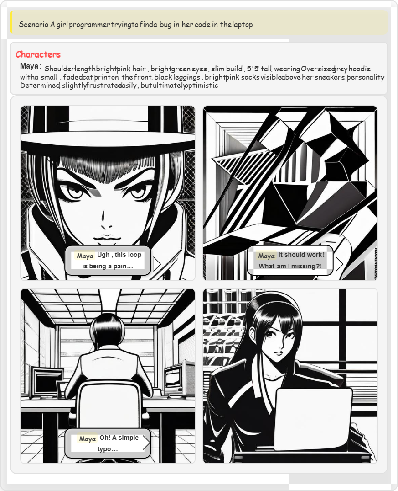

# Text2Comic Generator

A modern web application that transforms your creative scenarios into visually stunning, multi-panel comic strips using state-of-the-art AI for both images and dialogue. This project leverages advanced APIs to ensure character consistency, expressive dialogue, and a variety of professional comic art styles.

---

## Features

- **Automatic Comic Generation:** Enter a scenario and instantly get a 4-panel comic strip.
- **Multiple Comic Styles:** Choose from Manga, Cartoon, Realistic, or Classic Comic Book styles.
- **Expressive, Consistent Dialogue:** AI-generated dialogue that matches character personalities and story flow.
- **Character & Setting Consistency:** Maintains visual and narrative consistency across all panels.
- **Edit & Download:** Edit dialogues after generation and download your comic as a high-quality image.
- **Regenerate & History:** Regenerate comics with the same scenario and keep a history of your creations.
- **Dark/Light Theme:** Toggle between dark and light UI themes.

---

## How It Works

### 1. Scenario & Dialogue Generation
- **API Used:** [Google Gemini 1.5 Flash](https://ai.google.dev/gemini-api/docs)
- **Purpose:**
  - Converts your scenario into a structured, JSON-based comic script.
  - Defines detailed character descriptions, scene settings, and expressive, panel-by-panel dialogue.
  - Ensures character and setting consistency throughout the comic.

### 2. Comic Image Generation
- **API Used:** [Hugging Face Stable Diffusion API](https://huggingface.co/inference-api)
- **Models:**
  - `stabilityai/stable-diffusion-xl-base-1.0` (default for all styles)
  - Alternative fallback models: `SG161222/Realistic_Vision_V5.1_noVAE`, `runwayml/stable-diffusion-v1-5`, `CompVis/stable-diffusion-v1-4`
- **Purpose:**
  - Generates high-quality comic panel images based on the AI-structured script and selected style.
  - Prompts are engineered to match the chosen comic style and maintain visual consistency.

### 3. Comic Styles Supported
- **Manga:** Monochrome, dramatic ink lines, screentone shading, authentic Japanese manga look.
- **Cartoon:** Vibrant colors, bold outlines, expressive and playful character design.
- **Realistic:** Photorealistic textures, cinematic lighting, detailed anatomy.
- **Comic Book:** Classic superhero style, halftone dots, bold primary colors, vintage panel layouts.

---

## Getting Started

### Requirements
- Modern web browser (Chrome, Firefox, Edge, etc.)
- Internet connection (for API calls)

### Running the Application
1. **Open `index.html` directly in your browser.**
   - No build or server required; all APIs are called from the browser.
2. *(Optional)* Use the provided batch/script to launch if available.

### Usage
1. Enter a detailed scenario in the text area (e.g., "A robot learning to cook from an Italian grandmother in her kitchen").
2. Select your preferred comic style (Manga, Cartoon, Realistic, Comic Book).
3. Click **Generate Comic**.
4. Wait for the comic to be generated (image generation may take up to 45 seconds).
5. View, edit dialogues, regenerate, or download your comic.
6. Use the random scenario button for inspiration!

---

## API Keys & Configuration
- **All required API keys are pre-configured in the code for demo/testing purposes.**
  - **Google Gemini API Key:** For scenario/dialogue/character generation.
  - **Hugging Face API Key:** For image generation.
- **Note:** For production or public deployment, replace these with your own keys and secure them appropriately.

---

## Technologies Used
- **Frontend:** HTML, CSS, JavaScript
- **AI APIs:**
  - Google Gemini (for text, dialogue, and character/setting consistency)
  - Hugging Face Stable Diffusion (for comic panel images)
- **Image Download:** [html2canvas](https://html2canvas.hertzen.com/)

---

## Troubleshooting
- **Image generation slow or fails:**
  - The Hugging Face API may be under heavy load or rate-limited. Try again or switch styles.
- **Dialogue not expressive or inconsistent:**
  - Try re-generating; the Gemini API is designed to maximize expressiveness and consistency.
- **API errors:**
  - Check your internet connection. If using your own API keys, ensure they are valid and have sufficient quota.
- **Browser issues:**
  - Use a modern, up-to-date browser for best results.

---

## License

MIT License

---

## Acknowledgements
- [Google Gemini API](https://ai.google.dev/gemini-api/docs)
- [Hugging Face Stable Diffusion](https://huggingface.co/inference-api)
- [html2canvas](https://html2canvas.hertzen.com/)

---

*This project is for educational and demonstration purposes. For commercial use, ensure you comply with the terms of the respective APIs and models.* 
